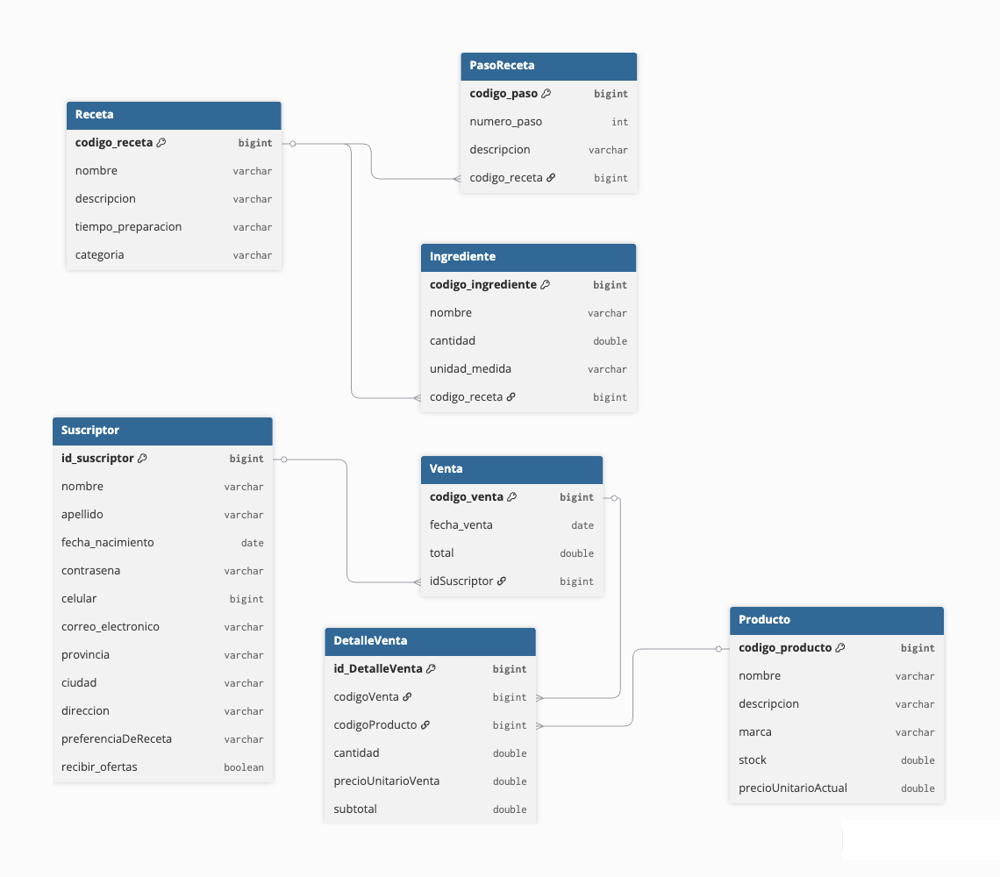

# Sitio Web de Cocina "Recetas de la Abuela"

Sitio web de cocina que permite a los usuarios explorar recetas y adquirir productos gastronómicos. Integra un frontend interactivo con una API REST desarrollada en Java con Spring Boot y persistencia en base de datos.

Demo del sitio disponible en: https://chiarapodio.github.io/recipe-web/index.html

El backend se encuentra dockerizado y desplegado en un servidor, con datos precargados de recetas y productos en una base de datos alojada en Render, lo que permite una navegación interactiva por el sitio.

## Tecnologías utilizadas

Backend:
- Java 17
- Spring Boot
- Maven
- JPA / Hibernate
- PostgreSQL

Frontend:
- HTML5
- CSS3
- Javascript
- Bootstrap

Testing:
- Postman.

## Funcionalidades principales

- Visualización de recetas almacenadas en la base de datos, con ingredientes, pasos, tiempo de preparación e imágenes ilustrativas.
- Tienda de productos gastronómicos, obtenidos desde el backend mediante solicitudes REST.
- Buscador por nombre tanto en recetas como en productos.
- Simulación de compra a través de un carrito interactivo.
- Registro de usuarios mediante una sección de Suscripción.
- Registro de ventas asociadas a suscriptores.
- Navegación fluida entre las distintas secciones del sitio.
- Diseño visual intuitivo, atractivo y responsivo, utilizando el sistema de grillas de Bootstrap.
- Persistencia de datos en base de datos MySQL.
- Uso de arquitectura multicapa.
- Uso de DTOs para optimizar la comunicación frontend-backend, ocultar datos sensibles y centralizar la lógica de negocio.

## Funcionalidades del backend (API)

* CRUD completo de recetas, productos, suscriptores y ventas.
* Métodos adicionales de lógica de negocio, como:
    - 1 Control y actualización de stock,
    - 2 Cálculo de totales y subtotales y
    - 3 Obtención de métricas de ventas.
* Endpoints REST invocados desde JavaScript en el frontend.
* Carga inicial de datos realizada mediante Postman, simulando acciones de un administrador del sistema.

## Diagrama del modelo
El siguiente diagrama representa las principales entidades del sistema y sus relaciones:

En el repositorio se incluye la colección de Postman utilizada para la carga de recetas y productos.
